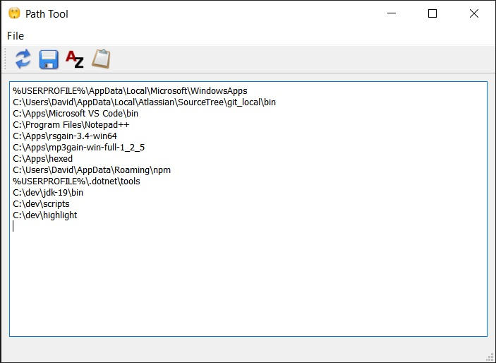

# Path Tool

A GUI utility for editing the Windows PATH environment variable. Was useful on Windows XP, back in the day.

Builds with Qt 4.8.7.

## Features
- Refresh from registry
- Save (Registry entry is updated and an environment setting changed message is broadcast to the system)
- Sort paths A to Z
- Copy original string to clipboard
